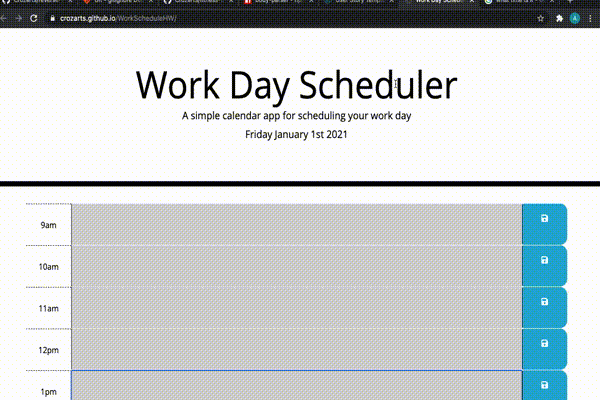

# WorkScheduleHW

## Assignment 
for this assignment we were assigned to create a simple Day Planner, utilizing jQuery and scope tools. This planner was to save events to local storage, give color coded blocks given the time. red for current, green for future, grey for past time blocks. the time blocks were to be for every hour 9am - 5pm. (resembling a typical 9-5 work schedule)



## User Story

```
AS AN employee with a busy schedule
I WANT to add important events to a daily planner
SO THAT I can manage my time effectively
```

## Acceptance Criteria

```
GIVEN I am using a daily planner to create a schedule
WHEN I open the planner
THEN the current day is displayed at the top of the calendar
WHEN I scroll down
THEN I am presented with time blocks for standard business hours
WHEN I view the time blocks for that day
THEN each time block is color-coded to indicate whether it is in the past, present, or future
WHEN I click into a time block
THEN I can enter an event
WHEN I click the save button for that time block
THEN the text for that event is saved in local storage
WHEN I refresh the page
THEN the saved events persist
```

# Links to my work
* Deployable URL: https://crozarts.github.io/WorkScheduleHW/
* Repository URL: https://github.com/Crozarts/WorkScheduleHW/

- - -
© 2020 Trilogy Education Services, a 2U, Inc. brand. All Rights Reserved.
